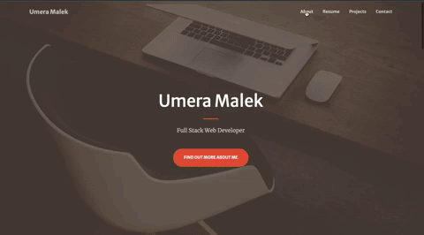

# umeramalek.github.io

  

# Table of Contents
  * [Description](#description)
  * [Built With](#built-with)
  * [Author](#author)
  * [License](#license)
  * [Questions](#questions)

 ## Description 
My portfolio that showcases my various projects and resumes, created during and after my time at the bootcamp. You can find ways to contact me on the portfolio. 

 ## Built-With

 * [HTML](https://developer.mozilla.org/en-US/docs/Web/HTML)
 * [CSS](https://developer.mozilla.org/en-US/docs/Web/CSS)
 * [Javascript](https://developer.mozilla.org/en-US/docs/Web/JavaScript)
 * [Bootstrap](https://getbootstrap.com/)
 * [Font Awesome ](https://fontawesome.com/)

 ## Author
  - [Link to Portfolio](https://umeramalek.github.io/)
  - [Link to Github](https://github.com/umeramalek)
  - [Link to LinkedIn](https://www.linkedin.com/in/umeramalek/)

## License

## Questions
Email - umeramalek796@gmail.com
Linkedin - https://www.linkedin.com/in/umeramalek/
